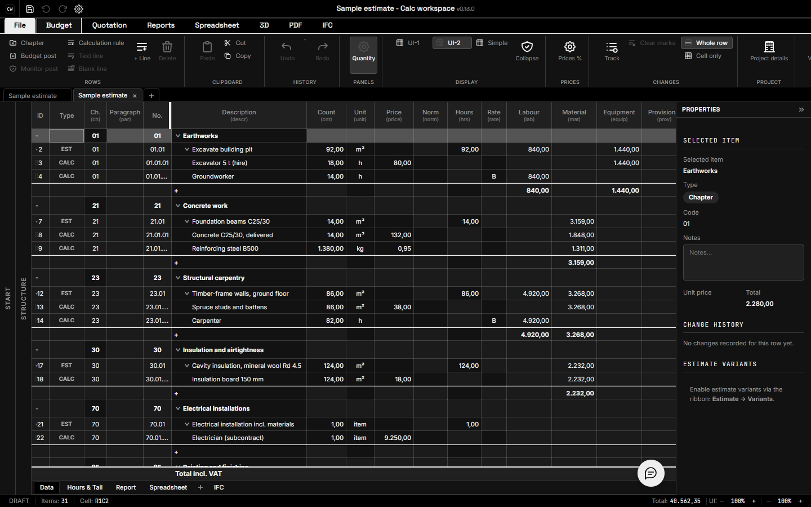

# geptechniek workspace · Calc

**Spanvision infra · GW · version 0.13.0**

geptechniek workspace · Calc is a local construction estimating application with multi-document cost grids, formulas, embedded spreadsheets, IFC tools, and reports. This edition keeps the existing calculation engine and file formats and supplies a new identity and monochrome presentation.



## Run locally

```powershell
npm ci
npm run dev
```

For the production browser preview:

```powershell
npm run build
npm run preview -- --host 127.0.0.1 --port 4225
```

The browser edition supports local estimates, import/export, spreadsheets, and printable HTML report previews. Native file dialogs, REST/WebSocket servers, and native PDF generation require the desktop edition.

## Architecture

- `brand.json` defines the organization, product, GW mark, desktop identifier, default theme, and optional service endpoints. React imports it through `src/config/brand.ts`; Rust consumes it at build time. `npm run brand:sync` updates Tauri packaging metadata.
- `src/services/calculation` and the existing Zustand document state retain totals, formulas, undo/redo, variants, and multi-document behavior.
- `src/styles/themes.css` defines semantic theme tokens. **Spanvision Mono** uses black chrome, `#121212` and `#202020` controls, a lighter `#1B1B1B` workspace, white/light-gray text, `#999999` supporting labels, and translucent white borders. Existing typography, animation, and alternate themes remain available. Document formatting, materials, photographs, and user-supplied logos retain their colors. Printed pages remain white.
- The Rust/Tauri shell retains the local REST API on port **9742**, WebSocket/MCP on **9741**, routes, commands, and file schemas. The new desktop identifier is `com.spanvisioninfra.calcworkspace`. On first launch it copies the legacy settings file only when the new profile has none; it never overwrites the old profile.
- Reports and export producers identify geptechniek workspace · Calc and Spanvision infra. Company information and imported document content are user data and remain intact.
- Built-in importers and locally installed extensions remain available. Inherited account, cloud, account AI, release feeds, extension catalog, and feedback startup requests are disabled. A user can still explicitly configure their own assistant provider. Optional service URLs are empty by default.

## Embedded edition

```powershell
npm run build:lib
```

The package is `@spanvision-infra/calc-workspace`. Import `CalcWorkspace` and the scoped stylesheet. The legacy `OpenCalcStudio` component, `ocs-*` classes/storage names, and technical schema identifiers remain compatibility exports. Embed theme changes are scoped to the application and its portals rather than the host document. See [the embedding guide](packages/embed/README.md).

## Reports dependency

The supplied archive omitted the reports submodule. This working copy restores it under `libs/openaec-reports` at revision `3a5fa40abdb443fc56ab306bbd82b6b0be5f47eb`. Keep that checkout available for native builds. The dependency's source and notices remain intact.

## Checks

```powershell
npm run typecheck
npm run lint
npm test
npm run build
npm run build:lib
npm run brand:validate
node qa/browser-check.mjs
```

Browser QA uses Microsoft Edge through Playwright and checks the production preview at 390 × 844, 820 × 1180, and 1440 × 900. Results and new screenshots are in `qa/`; final documentation captures are in `docs/screenshots/`. Optional external ÖNORM fixture/schema checks are explicitly skipped when their files are unavailable; point `A2063_DIR` to those files to run them.

Desktop development additionally requires Rust and the Tauri platform prerequisites. Windows needs the MSVC linker and Windows SDK. Use `npm run tauri -- dev` or `npm run tauri -- build`. See [verification results](docs/VERIFICATION.md) for the completed checks and current desktop limitation.

## Source notices

Applicable source/dependency attributions are preserved in [NOTICE.md](NOTICE.md) and `docs/source-provenance/`. Archived promotional material and old screenshots are provenance records and are not shipped in the application or used in the edition's documentation previews. Review the notice about the missing license file in the original archive before distributing binaries.

## Documentation archive

Historical plans, research, logs and superseded source documentation have moved out of this tool to [the suite source archive](../source-provenance/calc-workspace/). Current run instructions, useful technical guides, in-app Help and required source/license notices remain with the application.
