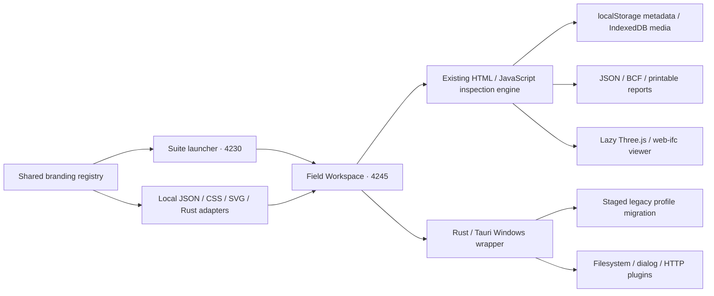

# Field Workspace architecture

Field Workspace is the FW inspection application under Spanvision infra. It joins the existing suite launcher at port 4245. Other suite identities and engines remain independent.

## Application and storage

The archive was imported without its embedded Git repository. TypeScript initialization mounts the existing inspection engine rather than replacing it with another framework. PDF.js remains available for floor plans, and IFC code and its packaged WASM load only when needed.

The `openFieldStudio` metadata key, `ofs_*` settings, `ofs-blobs` database, JSON version 2.0, connector fields such as `custom_ofs_*`, source identifiers and existing ERP attachment names stay compatible. Newly generated application presentation and standalone export names use Field Workspace. Customer project content, photos, model materials, drawing annotations and signatures keep their original colors and identities.

Browser HTTP uses fetch and the browser's cross-origin rules. Native HTTP uses the existing Tauri HTTP plugin. No authentication service, cloud storage service or public backend API is added. Upstream update checks are disabled. Account and scanning flows are labeled companion previews in the suite.

## Branding and appearance

`branding/brand.json` owns the Field module's FW mark, product identity, port and monochrome palette. `branding/field.mjs` generates standalone local adapters. `branding/prepare-field.mjs` creates native icons and complete dependency notices.

New profiles default to Spanvision Mono. Stored Light, Dark, Mono, language and valid recorded canvas colors take precedence. Page chrome uses #000000; surfaces use #121212, #1B1B1B and #202020; text uses #FFFFFF, #EEEEEE and #999999. Translucent white borders and focus rings, grayscale selections, and icon/text feedback communicate interactive states. Mobile panels stack, controls wrap, navigation scrolls within its strip, and dialog contents scroll inside a contained overlay.

## Native startup and migration

The Windows identifier is `com.spanvisioninfra.fieldworkspace`. The main webview starts with `create: false`, so native startup can migrate data before WebView2 opens a profile.

1. An established destination profile is used without modification.
2. If the destination is absent or empty, native startup snapshots the legacy `com.openaec.openfieldstudio` profile and copies its persistent files into a unique sibling staging directory. Regenerable browser caches are omitted.
3. Files are opened exclusively on Windows. A lock or changing snapshot aborts the copy and removes only that operation's staging directory. A native dialog offers Retry or Exit.
4. A successful copy gets a migration marker and is renamed into place. The legacy profile is retained. The new webview then opens using the destination directory.

`SPANVISION_FIELD_DATA_ROOT` overrides the profile parent for isolated native tests. Browser origins cannot share storage automatically; project JSON export/import supports browser migration.

## Build and delivery

Use `npm ci` inside this application, followed by `npm run build`, for a standalone browser build. From the suite root, `node branding/build.mjs field hub` builds and stamps both previews. `npm run preview:field` serves the standalone editor; `npm run preview:suite` serves the launcher.

`npm run build:field:windows` uses Rust/MSVC and Tauri to produce the unsigned Windows x64 executable and NSIS installer. Build caches are outside the application source. `npm run verify:field` covers responsive browser workflows; `node qa/field/native-smoke.mjs` checks the delivered application in isolated WebView2 profiles. `branding/package-field.mjs` packages source, Windows files and verified screenshots.

Attribution, modification notices, declared CC BY-SA 4.0 terms and third-party licenses are available through the application's information button and packaged legal files. See `qa/field/VERIFICATION.md` in the suite root for evidence and practical testing limits.
