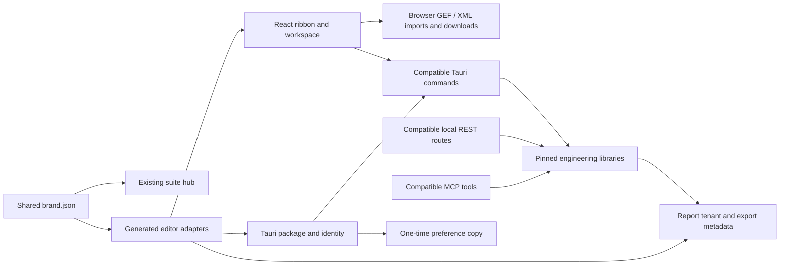

# Spanvision infra — geptechniek workspace architecture

## Integrated suite
Geotechniek is registered in the shared suite launcher and assistant suggestions. The existing hub owns landing, simulated scan/OCR, suggestions, login, sign-up and account screens. Account information stays in session memory; password input is cleared after the preview flow. The hub remains at http://127.0.0.1:4230; the geotechnical browser edition is at http://127.0.0.1:4235. The registry supports additional existing tools without hard-coded tool counts.

## Identity and theme
`branding/brand.json` is the suite identity and palette source. `branding/geotechniek.mjs` generates standalone `apps/desktop/brand.json`, the vendor identity manifest, the complete React theme adapter, localized presentation, native package configuration and report tenant YAML. The existing GW paths generate browser, installer and file-association icons.

Fresh profiles use Spanvision Mono. Saved theme, language and extension choices retain their original preference keys. The browser retains the `ogs:` prefix for compatibility. The native edition uses `com.spanvisioninfra.geotechniek`. During native setup, a one-time migration reads the previous `foundation.openaec.opengeotechniekstudio/preferences.json`, copies missing keys into the new profile, preserves newer values and records a migration marker. The original profile is never written.

UI tokens apply black (#000000) chrome, #121212 panels, #1B1B1B drawing surround, #202020 raised controls, #FFFFFF/#EEEEEE text, #999999 secondary labels and translucent white borders/focus. Paper, CPT curve colors, Robertson classifications, map imagery, photographs, annotations and customer-uploaded logos remain separate from these tokens.

## Application boundaries

## Engineering and reports
The warehouse is vendored at commit `6e8738c075719e2fc8fcf918d969406f98927b07`. The required workspace members are cpt-core, openaec-core, openaec-layout and openaec-engine. Cargo paths resolve within this source distribution; the native dependency lockfile is retained, with only the root package identity changed.

Single-CPT output keeps the existing full-page chart engine and section order. Its cover, GW symbol, grayscale ribbons and closing page use the Spanvision adapter. Multiple-CPT reports use the same pinned section/layout engine with an explicit Spanvision tenant and a new in-memory configuration entrypoint. Both routes retain engineering charts and natural basemaps. The local tenant template engine also uses Spanvision identity. PDF creator/producer metadata is stamped consistently, without replacing user project titles or authors.

The legacy tenant ID remains an accepted alias, but tenant discovery presents Spanvision infra. Customer logos remain untouched. Compatibility keys including OpenGeoProject, OpenGeo_CptMeasurements, openGeoStudio metadata, ogs events, IFC/GIS schemas, routes, tool names and IPC commands retain their original spelling and meaning.

Report verification also corrects page-tree serialization in the local tenant engine, embeds its existing TrueType fonts as Unicode CID fonts, and normalizes supplementary Unicode mappings and PDF metadata. Long single-CPT cover titles fit the page, metadata occupies a separate row, and unnamed chart sections omit empty headings. Section page-break flags are honored, drawing disclaimers align inside the page, and supporting labels on white paper use a readable darker gray. These repairs affect presentation and serialization only. Numerical round trips are checked to 1e-12; strings and object shapes are checked exactly.

## Interaction and accessibility
Desktop ribbon, explorer, properties and document layouts remain. At widths up to 1100 px, explorer/properties become mutually exclusive drawers with focus cycling, Escape close and an inert main canvas. Ribbon tabs and command groups scroll inside their containers. Mobile settings use horizontal navigation and dialogs fit the viewport. Shared modals announce their titles, contain focus, support Escape and restore the triggering control. Existing motion remains, with reduced-motion preferences honored.

Feedback creates a local text download. Release notes are local. Account and OCR demonstrations are explicitly marked. Backend calculations and experimental/alpha notices keep their existing behavior.

## Reproducible tooling
- `npm run brand:sync`: generate identities and palettes.
- `npm run brand:icons`: generate GW packaging assets.
- `npm run brand:check`: detect adapter drift.
- `npm run brand:check -- --modules=geo`: verify the hub and Geotechniek adapter while other suite modules are being edited.
- `npm run build:suite`: build and fingerprint each registered browser application and the hub.
- `npm run preview:suite`: serve only current stamped builds.
- `npm run verify:suite`: hub and tool layout smoke checks.
- `npm run verify:geo`: detailed geotechnical responsive, focus, file and preference checks.
- `npm run build:geo:windows`: build the Windows executable and NSIS installer using the dependency lockfile.
- `npm run verify:geo:backend`: verify local REST/MCP presentation, imports, project round trips and reports against the Windows executable.

Build caches use D:\\SpanvisionToolchain on this machine because C: is space-constrained. The build tools and Windows SDK were provisioned under D:\\SpanvisionToolchain\\BuildTools. Portable deliveries include the matching WebView2 loader and tenant assets; NSIS embeds the WebView2 bootstrapper.

## Provenance and delivery
Original copyright and license records live in THIRD_PARTY_NOTICES.md, legal/, native tenant notices and vendor/PROVENANCE.md. These records are separate from product promotion. The source distribution excludes dependency/build caches, machine credentials and VCS internals. QA results, rendered reports, screenshots, Windows assets, installer and source ZIP are delivered alongside the architecture. Authentication remains a labeled local demonstration; browser report generation requires the native application.
