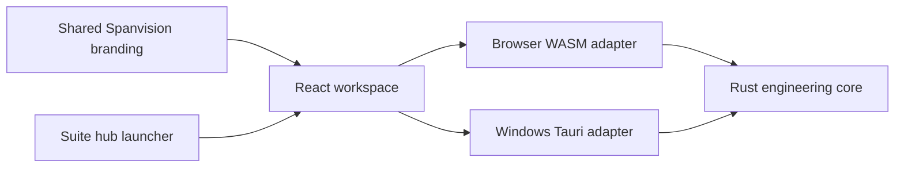

# Pile Plane Workspace — Spanvision infra

Version 0.4.2 Alpha. Module ID `pile`, product initials `PPW`.

The pile application is independent of other suite modules. Only the pile subtree was imported; the BIM validator, Git history, environments and caches were excluded. The hub provides a launcher and suggestion entry, without owning pile projects or calculations.

`branding/brand.json` defines organization, product, mark and palette. `branding/pile.mjs` generates frontend/Rust identity, the PPW vector mark, Tauri configuration and token adapter; the icon generator produces matching native icons. Engineering crate names, MCP tools, command contracts and IFCPP schema remain compatible.

`crates/pile-plan-core` remains the authority for import, validation, CPT selection, capacities, costs, grouping, assignments, topology and optimization. WASM and Tauri share this core. React owns presentation and application preferences. Existing worker/HiGHS adapters are retained. Drawing geometry keeps its single coordinate transform and resize compensation.

Fresh profiles use `spanvision-mono`. Existing theme IDs remain valid; `openaec` appears as Dark. Chrome uses grayscale tokens while drawing symbols, engineering status, legend colors and project-owned styles remain independent. `canvasBackground` is an additive `auto|light|mono` application preference. Auto uses #1B1B1B for Mono and the legacy light canvas for other themes. Preview/Cancel/Save remain transactional and do not mark projects dirty.

Desktop retains explorer/canvas/properties at widths >=1024px. Tablet uses an explorer drawer; below 768px both side panels use drawers and commands use a compact ribbon menu. Touch supports tap selection, drag pan, focal pinch zoom and explicit lasso mode.

Windows uses `com.spanvisioninfra.pileplaneworkspace` and `spanvision-pile-plane-workspace.exe`. First launch copies valid legacy preferences only when the new preference file is absent, preserving the original profile. Browser database names remain compatible on the same origin; changing origin requires IFCPP export/reopen. Existing project metadata is accepted; newly serialized metadata uses Spanvision identity.

Feedback is a local Markdown/optional image download. Hub login, sign-up, account, assistant and scan screens retain demonstration labels. No online authentication, OCR or assistant service is added.

The suite build regenerates WASM before frontend compilation. Fingerprints include Rust/WASM sources, frontend/configuration, native source/configuration/icons/capabilities, legal files, samples and helpers. Stale previews are rejected. Pile preview uses port4255 and the hub remains on4230. Delivery includes unsigned Windows artifacts, LGPL notices, corresponding source, build instructions, screenshots and verification results.
