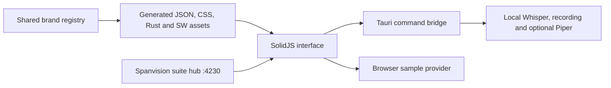

# Spanvision infra · speech workspace

The application remains a standalone SolidJS/Vite interface over Rust/Tauri and
the bundled local Whisper engine. The existing Spanvision suite launches it as
the Speech module. The suite retains its GW identity; Speech owns the SW mark.
The archive's CUDA binary is retained alongside a checksum-verified Windows CPU
bundle, selected when GPU use is off or the NVIDIA driver is unavailable.

## Identity and packaging

`../branding/brand.json` defines the organization, theme, palette and module
overrides. `../branding/speech.mjs` generates the standalone adapters in this
directory. Native icons are generated from the SW vector mark. After generation,
this application can build independently of the suite.

Native identity: `com.spanvisioninfra.speechworkspace`, executable
`spanvision-speech-workspace`, library `spanvision_speech_workspace_lib`.
Bundled engine binaries and models retain technical names required by the engine.
Apache-2.0 and original attribution appear in Open-source notices.

## Runtime boundary

`src/lib/runtime.ts` identifies the Tauri runtime. `src/lib/api.ts` preserves local
command names and adapts existing wire fields to interface settings. Rust commands
retain local transcription events and export formats. Remote transcription branches,
account client integration and cloud discovery are removed. Former account commands
return disabled compatibility responses.

Native startup opens the familiar dictation workspace. Browser startup opens the
landing page on port 4240. Browser capture, model downloads, OS integration and
voice generation are unavailable; sample transcripts are clearly labeled. Audio
import previews read only a selected filename and use the built-in transcript.
They never read or upload audio. Browser startup performs no speech-service probing
and uses no automatic Web Speech fallback.

Login, sign-up and account screens are frontend previews. Profile state exists
only in memory. Form submission clears the password field; no credentials are
authenticated, transmitted or persisted. Reload resets the preview profile.

## Preferences and migration

Fresh profiles use Spanvision Mono. Saved light/dark choices use grayscale
compatibility palettes. The transcript surface is #1B1B1B; surrounding chrome is
black and panels use #121212 or #202020. Translucent borders, focus rings, state
labels, icons and existing animations distinguish interactions. Overlay windows
retain transparent backgrounds and load the saved theme.

`src-tauri/src/migration.rs` imports missing local settings, dictionaries, speaker
profiles and Piper data once. Existing Spanvision files win. Legacy models remain
discoverable without duplicating large model weights; saved export directories
are retained. Account state and cloud service caches are excluded. Reading and
saving preferences forces legacy remote processing off. The browser migrates
accessible same-origin settings, dictionary and estimator keys similarly.

## Responsive interface and delivery

The desktop sidebar is preserved at widths of at least 900px. Between 600px and
899px it becomes a rail with accessible labels and tooltips. Below 600px it opens
as a drawer with keyboard containment, Escape dismissal and focus restoration.
The audio-import dialog contains focus and restores its launch control when closed.
Transcripts remain selectable and editable; long filenames wrap within dialogs.

Suite scripts sync identity, generate icons, build, stamp and preview Speech.
Build stamps fingerprint each module independently. An independent Speech server
can join an existing suite preview without interrupting its other tools.
`../qa/speech/verify.mjs` checks the browser at 320, 390, 820 and 1440px; native
tests cover migration, missing models, real process cancellation and a CPU transcription fixture.
See `../qa/speech/VERIFICATION.md` for observed results and hardware-dependent checks.
